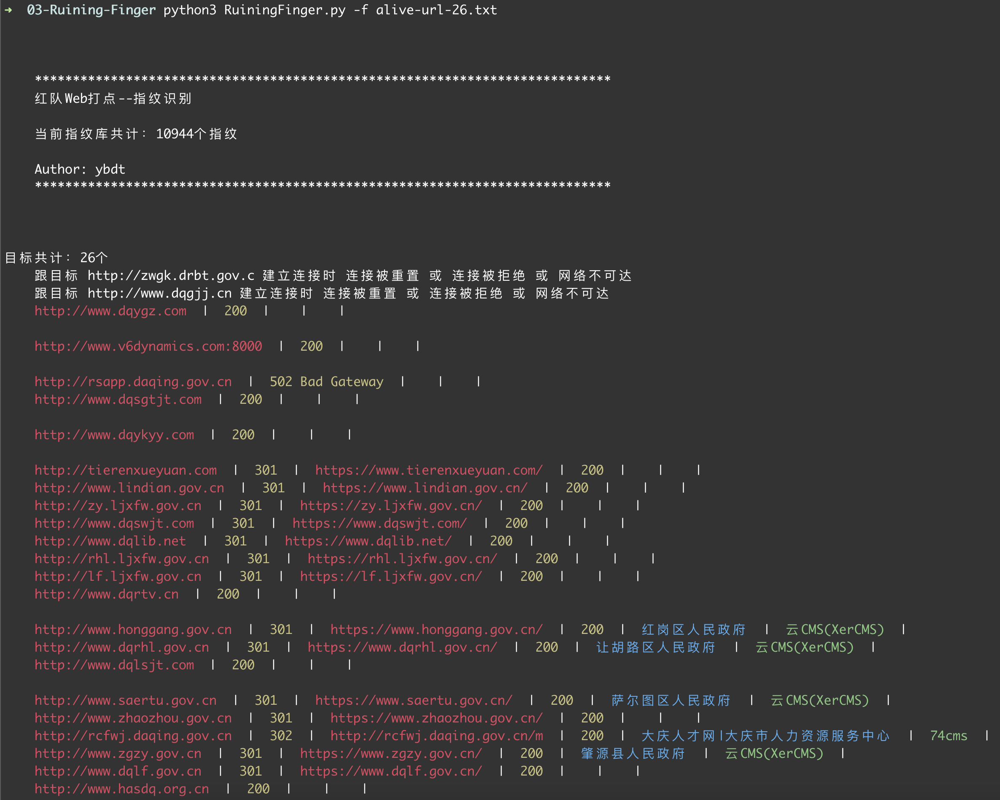
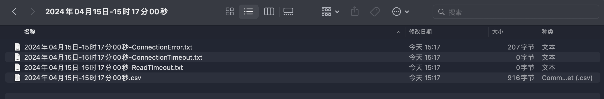

# 前言
看到别人开源的指纹识别工具，不写一款自己的就很难受，这是之前用Python实现的一款多线程指纹识别工具，现在开源出来

# 用法
使用方式很简单，如下图  
  
结果会输出到csv中，如下图  
  

# ToDo1
```
针对上次发的goby指纹，做了一下处理

最终琢磨出来一套适合自己的懒人逻辑。

"product": "天行网安-集中监控与管理系统",
 "rule": "title=\"集中监控与管理系统\" && body=\"loginAction.action\"",
拿这个goby指纹来说，如果我们去识别的话 需要先判断rule里面是否有&& 等表达式 在进行一些列复杂逻辑处理

我这里来对这个指纹进行一下小小的修改

"rule": "title==\"集中监控与管理系统\" and \"loginAction.action\" in body",
这里我们一看就懂了，有title 和body 两个变量 如果title等于字符串和字符串 在body 里面 就成功识别。


下一步就是 怎么让我们这个规则字符串 直接变成判断条件呢，最终我找到了eval
eval() 函数将字符串转换为相应的对象，并返回表达式的结果。这不拖拖的符合我们条件。

不过使用eval 函数可能会存在安全隐患，这里我是先采用ast.parse 进行了解析 然后在使用，自己测试的话并没有成功执行恶意命令，太菜了不理解原理，还希望各位大哥指导下。
```
# ToDo2
阅读这个项目[https://github.com/gubeihc/fingerprint](https://github.com/gubeihc/fingerprint)并从中学习
# ToDo3
工具逻辑是只识别一次指纹，思考如何进行优化  
favicon.ico报错  
添加指纹  